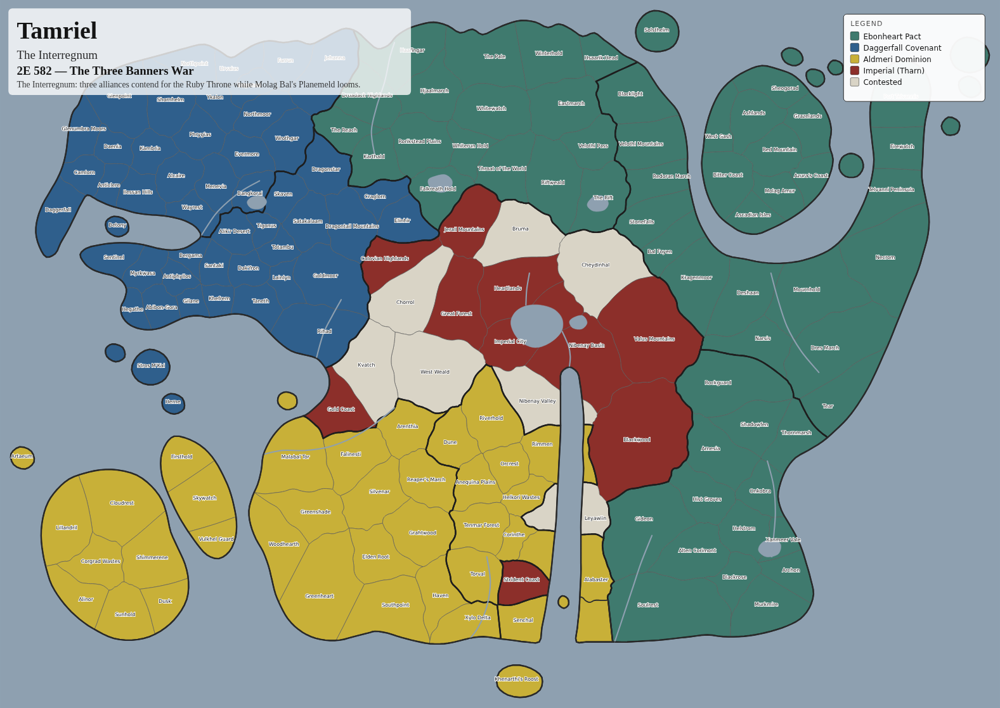
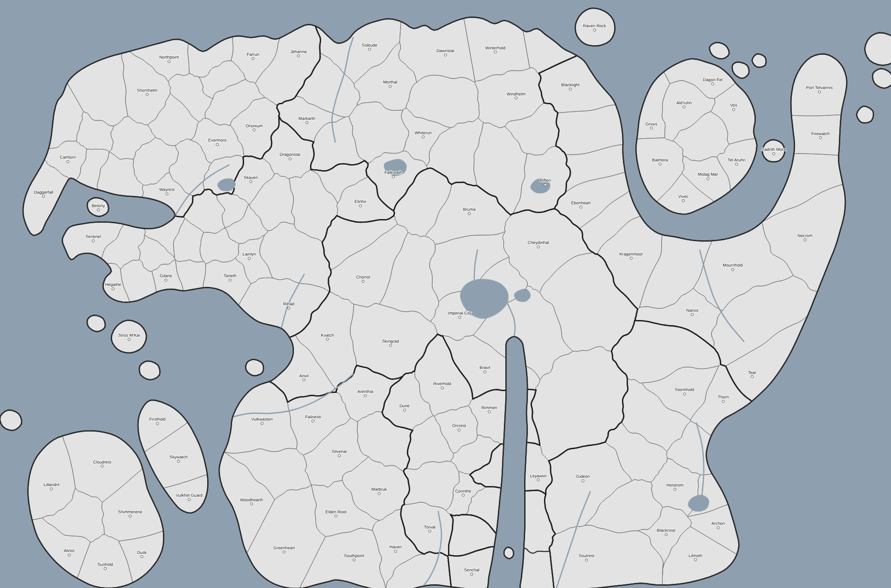

# Tamriel MapChart

A MapChart-style colouring tool for Tamriel — the same idea as
[mapchart.net/tamriel.html](https://www.mapchart.net/tamriel.html), but subdivided
much further: **159 regions across the nine provinces**, with save/edit/colour tools
and a timeline that plays border changes over the eras.

Open `index.html` in a browser, or use the self-contained single file
`tamriel-mapchart.html` (no server, no dependencies, works from `file://`).



Uncoloured, in the reference map's own styling — city dots and city names, so you
can see the subdivision against the original:



## What's in it

**The map.** Every province is broken into its lore regions — Skyrim's nine holds,
High Rock's Breton kingdoms, Hammerfell's Daggerfall-era city-states and Alik'r
provinces, Cyrodiil's counties plus the Colovian/Nibenese lands, Vvardenfell's
nine districts and mainland Morrowind's Great House territories, Black Marsh's
marsh regions, Anequina and Pellitine, Valenwood's forest domains, and Summerset
with Auridon and Artaeum. Coastlines, the Iliac Bay, the Inner Sea, Niben Bay,
lakes and major rivers are all drawn in.

**Colouring.** Click to fill, drag to paint a run of regions, <kbd>Shift</kbd>+click
for a whole province, <kbd>Alt</kbd>+click to clear. Seven themed palettes plus any
custom colour. The legend builds itself as you paint — rename a group, recolour every
region in it at once, or click it to reselect those regions.

**Selecting.** Search across region, province and city names, with lore aliases
(“vvardenfell”, “alik'r”, “holds”, “nibenay”, “argonia”…) that expand to the right
set. Or work down the province tree. Invert, select-all, fill-selection.

**Styling.** Five map themes (MapChart, Parchment, Slate, Ashland, Ink), region and
province border widths, region names or MapChart-style city names, automatic
label placement that reveals more names as you zoom in, city markers, rivers,
lakes, coastline, title/subtitle, and a legend you can drag anywhere.

**Time.** Capture the current colouring as a keyframe with an Elder Scrolls date,
then scrub or play the timeline — colours cross-fade between frames, so borders
appear to move. Three histories are built in:

| History | Frames | Covers |
|---|---|---|
| Ages of Empire | 9 | Alessian rebellion → First Empire of the Nords → Alessian Order → Reman's Second Empire → Akaviri Potentate → Three Banners War → Tiber Septim → Third Empire → after the Great War |
| The Three Banners War | 6 | 2E 582, the front line moving across Cyrodiil season by season |
| The Great War | 6 | 4E 170–180, the Dominion invasion, the Red Ring, the Concordat, Hammerfell's secession |

**Simulation.** A growth simulator runs factions over the region adjacency graph
(159 regions, 178 sea crossings). Give each faction a colour and a starting
territory — or use a preset (Three Alliances, Nine Provinces, Capitals Only), or
seed one faction per colour already on your map — then set expansion, aggression,
sea-crossing difficulty and revolt chance and run it. Each turn becomes a keyframe,
so you can play the resulting history back. Runs are seeded, so the same seed
always produces the same history.

**Saving and exporting.** Auto-saves to the browser; named save slots; export as
PNG (up to ×6), standalone SVG, a `.json` map file you can re-open, a CSV of the
painting, or every timeline frame as its own PNG for stitching into a GIF or video.

## Keyboard

<kbd>B</kbd> paint · <kbd>V</kbd> select · <kbd>I</kbd> pick colour ·
<kbd>P</kbd> toggle province tool · <kbd>1</kbd>–<kbd>9</kbd> palette colour ·
<kbd>K</kbd> capture frame · <kbd>Space</kbd> play/pause ·
<kbd>Ctrl</kbd>+<kbd>Z</kbd> / <kbd>Ctrl</kbd>+<kbd>Shift</kbd>+<kbd>Z</kbd> undo/redo ·
<kbd>Ctrl</kbd>+<kbd>S</kbd> save · <kbd>0</kbd> fit · <kbd>+</kbd>/<kbd>−</kbd> zoom ·
<kbd>Esc</kbd> clear selection

## How the map is generated

The region shapes are not hand-drawn one by one, and they are not raw Voronoi
cells either — raw Voronoi gives dead-straight borders that look computed.

1. `tools/geo_data.py` holds the hand-authored geography: the mainland coastline as
   one clockwise ring, 19 island rings, lakes, rivers, and 159 region seeds, each
   tagged with its province and city.
2. `tools/build_map.py` tessellates the seeds with a Voronoi diagram computed
   **per landmass**, so an island is never claimed by a mainland region.
3. The authored coastlines are resampled through a **centripetal**
   Catmull-Rom spline. The curve passes through every typed point but arrives
   smoothly, which is what turns a hand-typed outline into a coast that reads as
   drawn; centripetal parameterisation (alpha = 0.5) cannot overshoot into a cusp,
   so narrow inlets and cape tips survive. 457 authored points become 1391.
4. Every interior Voronoi edge is then replaced by a fractal
   (midpoint-displacement) polyline, which is finally smoothed by two Chaikin
   passes. Both operations are keyed on — or symmetric in — the edge's vertex
   pair, so the two regions sharing a border generate the *identical* line: the
   tiling stays watertight, with no slivers or gaps, while the Voronoi vertices
   stay put so triple junctions remain exact. Displacement is clamped in both
   proportion and absolute size, so the very long outer cell edges stay tame.
5. Cells are clipped against that smooth coastline, which supplies the natural
   land/sea edge, and a final pass hands each cell only the area no earlier cell
   claimed, so overlap is exactly zero (the build reports coverage — it should
   read 100.00%).
6. Small unseeded islets are attached to the region nearest them, so they colour in
   with it instead of sitting on the map as grey holes.
7. Adjacency comes out of the Voronoi ridges, plus short sea crossings and a table
   of historically-connected crossings, and ships with the map for the simulator.

To change the map, edit `tools/geo_data.py` and rebuild:

```bash
pip install numpy scipy shapely
python3 tools/build_map.py      # regenerates data/tamriel-map.js
python3 tools/bundle.py         # regenerates tamriel-mapchart.html
```

`build_map.py` reports any seed that falls in the sea, any cell that comes out
empty, and the total coverage, so a bad edit is caught immediately.

## Layout

```
index.html               the app
tamriel-mapchart.html    the same app as one portable file
css/app.css
js/state.js              palettes, themes, document state, undo, storage
js/mapview.js            SVG build, theming, pan/zoom, hit-testing, label placement
js/timeline.js           keyframes, cross-fade playback, the built-in histories
js/sim.js                the faction growth simulator
js/exporter.js           standalone SVG, PNG, JSON, CSV
js/ui.js                 panels, bindings, overlays, the event bus
data/tamriel-map.js      generated geometry (159 regions, 9 provinces)
tools/geo_data.py        hand-authored geography and region seeds
tools/build_map.py       the generator
tools/bundle.py          single-file build
```

Region and place names follow the Elder Scrolls provincial maps. The Elder Scrolls
is a Bethesda property; this is an unofficial fan tool.
