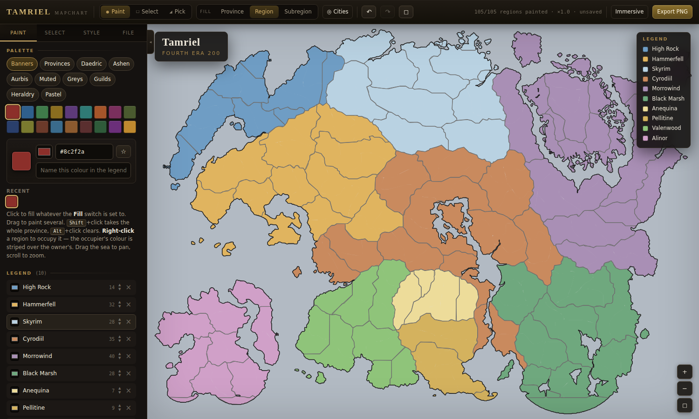

# Tamriel MapChart

A MapChart-style colouring tool for Tamriel — the same idea as
[mapchart.net/tamriel.html](https://www.mapchart.net/tamriel.html), with the map
**traced 1:1 from the reference image**.

You colour at whichever level you want, chosen with the **Fill** switch in the
toolbar:

| Level | What one click fills |
|---|---|
| **Province** | one of the ten provinces |
| **Region** | one of the reference map's own 105 regions — the default |
| **Subregion** | one of the 225 finer subdivisions |

At Province level the map looks exactly like the original. The map carries no names, like the
reference — though **capital cities**, **other cities** and **city names** are all
layers you can switch on in Style, with capitals drawn larger. Zoom goes to about
200×, and the panel folds away with <kbd>Tab</kbd> to give the map the full window.

Open `index.html` in a browser, or use the self-contained single file
`tamriel-mapchart.html` (no server, no dependencies, works from `file://`).



## The trace

The coastline and every region border come out of the reference image pixel by
pixel — nothing here is a hand-typed coordinate, so the outline matches 1:1.

The reference is flat-shaded, which is what makes that possible: land `#dddddd`,
sea `#b2bac3`, region borders as thin light-grey strokes, province borders and the
coastline much darker, labels darker still. `tools/trace_ref.py`:

1. **Classifies** every pixel into land, sea and ink.
2. **Continues the four coastal spans the screenshot cuts off** at its bottom edge
   with a shallow synthesised curve. This is the only geometry in the map that is
   not from the image; everything else is traced.
3. **Splits the land on the reference's own border strokes.** Labels can't be told
   from borders by colour — province borders and the coast are just as dark — so
   they're separated by shape: label and marker ink is dark *and* small *and*
   compact, while every real border is either light grey or long. Strokes are 1px
   and anti-aliased, so pinholes get closed first, or two regions leak into one.
   That recovers **105 regions** -- every one of the reference's own.
4. **Grows each region back over the strokes**, so the regions tile the land exactly
   rather than leaving gaps where the borders were.
5. **Names them from the reference's city labels**, then floods each province across
   the region adjacency so provinces stay contiguous. A border stroke is 1px and
   anti-aliased, so a few of them fall back to the land tone for a pixel or two and
   two of the reference's regions leak into one cell -- one cell held Falkreath,
   Riften *and* Cheydinhal, which put a third of Cyrodiil inside Skyrim. Closing the
   web harder cannot fix every pinhole without eating the genuinely narrow regions,
   so instead: each of the reference's regions carries exactly one city label, so a
   cell holding n of them is n regions stuck together, and it is watershedded apart
   with those cities as markers and the image itself as the relief. The cut then
   follows the faint stroke that is actually there rather than an invented line.
   Anything left unlabelled is named for the feature the lore puts there.
6. **Adds depth** — region → subregion — by proportional recursive bisection: k
   parts are split into halves of ceil(k/2) and floor(k/2) parcels, so a 5-way split
   cuts 2:3 rather than 1:4 and every parcel lands near the target area. k-means was
   the obvious choice and the wrong one: it leaves interior clusters, which come out
   as discs, very obvious on the big southern regions. A cut always produces two
   parcels that each reach the edge, so subdivisions look carved rather than stamped
   out. The cut follows a displacement with a coastline's spectrum — one broad sweep
   carrying progressively finer detail — scaled to its own length. The rolloff has to
   be steep: at 1/h the higher harmonics carry nearly as much as the fundamental and
   the cut comes out as a tight zigzag that reads as noise rather than a border; at
   1/h**1.9 the fundamental dominates and the cut is a long meander that only ripples
   on its way across. The whole meander then slides until it cuts off exactly the
   share asked for — falling back to a straight quantile line instead is what used to
   put dead-straight spokes across the bigger regions. Because the displacement stays
   a single-valued function of the across-axis it can bend as much as it likes
   without crossing itself, so the cut is always a clean split. That gives **225
   subregions** whose cut parcels span 1712–2880 px, a 1.7× spread, with the most
   uneven set of siblings at 1.62×.

The build reports coverage against the traced land — it should read ~100%.

```bash
pip install numpy scipy shapely pillow scikit-image
python3 tools/trace_ref.py     # regenerates data/tamriel-map.js
python3 tools/bundle.py        # regenerates tamriel-mapchart.html
```

`trace_ref.py` expects the reference screenshot at the path in `REF`.

## Three border tiers

Because the trace keeps the reference's regions *and* adds subdivisions, the map
draws its borders in a hierarchy. The **Fill** switch sets a sensible default, and
**Style** lets you turn each tier on or off and set its width:

| Tier | What it is |
|---|---|
| Province | the ten provinces |
| Map region | the 105 regions traced from the reference |
| Subregion | 225 subdivisions |

Only one is visible at a time, chosen by the Fill switch.

Border widths are in map units but thin as you zoom in, so they stay readable at
200× instead of swallowing the map.

Colour is always stored per parcel, so switching levels never loses anything:
filling a region just fills all of its parcels at once.

## Occupation

**Right-click** any region for an occupation menu. Occupying paints the occupier's
colour as a diagonal hatch *over* the owner's, so a red power occupying a yellow
province reads as red-on-yellow stripes rather than replacing it — occupy or
liberate a single region or a whole province at once. Occupation is stored
separately from ownership, so liberating restores the original colour untouched,
and both show up in the legend and in exports.

## City mode

Each of the 78 cities has a **true circular district** around it. Toggle
<kbd>C</kbd> (or the City button) and clicking a disc colours it, at whatever fill
level you are on; unpainted discs show as a dashed circle. Capitals get a larger
disc and a filled marker.

## Lore

Provinces follow the Fourth Era, per Lady Norevar's *Tamriel and its Nations*
(4E 200): Summerset is **Alinor**, and Elsweyr is not one polity but the two
Khajiiti kingdoms of **Anequina** in the north and **Pellitine** in the south —
ten provinces, each tagged with the nation that holds it (Mede Empire, Aldmeri
Dominion, Hammerfell, Morrowind, Black Marsh).

Regions carry their lore names where lore gives them one distinct from their seat
— Solitude sits in Haafingar, Wayrest in Stormhaven, Anvil on the Gold Coast,
Balmora on the Bitter Coast — with the city kept as a separate field, the way both
reference maps label them. Regions whose name lore leaves open keep their
city-state name.

## What's in it

**Colouring.** Click to fill whatever the **Fill** switch covers, drag to paint
several, <kbd>Shift</kbd>+click for a whole province, <kbd>Alt</kbd>+click to clear.
Ten palettes plus any custom colour, a strip of recently used colours, and a
star to keep one in your own swatch library. Quick fills colour the map by
province, by region, at random, or just the parts you have not reached yet.

**Selecting.** Search returns map regions, not every subdivision, across region,
province and city names, with lore aliases
(“vvardenfell”, “holds”, “colovia”, “nibenay”, “argonia”, “alik'r”…) that expand to
the right set. Or work down the province tree. Invert, select-all, fill-selection.

**Immersive view.** <kbd>F</kbd> drops the whole interface and gives the map the
window; <kbd>Tab</kbd> just folds the side panel away.

**Styling.** Five map themes (MapChart — sampled off the reference — plus Parchment,
Slate, Ashland, Ink), the three border widths, city marker size, stripe width,
optional names and city markers, a title card on the map, and a legend you can drag
anywhere. One button restores the whole default style.

**Inspecting.** The Select panel carries an inspector: hover or select anything and
it names the province, the map region, the subregion, how many siblings that region
has, the colour and its legend group, who is occupying it, and every region it
borders.

**Legend.** Entries build themselves as you paint. Rename one, recolour every region
in it at once, reorder them, click one to reselect its regions, or drop it and clear
them. On the map the legend can carry per-colour counts, run in up to four columns,
sit in any corner, or go wherever you drag it.

**Saving and exporting.** Auto-saves to the browser; named save slots; export as PNG
(up to ×6), standalone SVG, a `.json` map file you can re-open, or a CSV of the
painting. Recently used colours and a saved swatch library persist across sessions.

## Keyboard

<kbd>B</kbd> paint · <kbd>V</kbd> select · <kbd>I</kbd> pick colour ·
<kbd>P</kbd> cycle fill level · <kbd>1</kbd>–<kbd>9</kbd> palette colour ·
<kbd>Ctrl</kbd>+<kbd>Z</kbd> / <kbd>Ctrl</kbd>+<kbd>Shift</kbd>+<kbd>Z</kbd> undo/redo ·
<kbd>Ctrl</kbd>+<kbd>S</kbd> save · <kbd>0</kbd> fit · <kbd>+</kbd>/<kbd>−</kbd> zoom ·
<kbd>C</kbd> city mode · <kbd>F</kbd> immersive · <kbd>Esc</kbd> clear selection

## Layout

```
index.html               the app
tamriel-mapchart.html    the same app as one portable file
css/app.css
js/state.js              palettes, themes, document state, undo, storage
js/mapview.js            SVG build, theming, pan/zoom, hit-testing, labels
js/exporter.js           standalone SVG, PNG, JSON, CSV
js/ui.js                 panels, bindings, overlays, the event bus
data/tamriel-map.js      generated geometry (225 subregions, 105 map regions,
                         10 provinces, 78 city districts)
tools/trace_ref.py       the tracer
tools/bundle.py          single-file build
```

Region and place names follow the reference map's city labels. The Elder Scrolls is
a Bethesda property; this is an unofficial fan tool.
